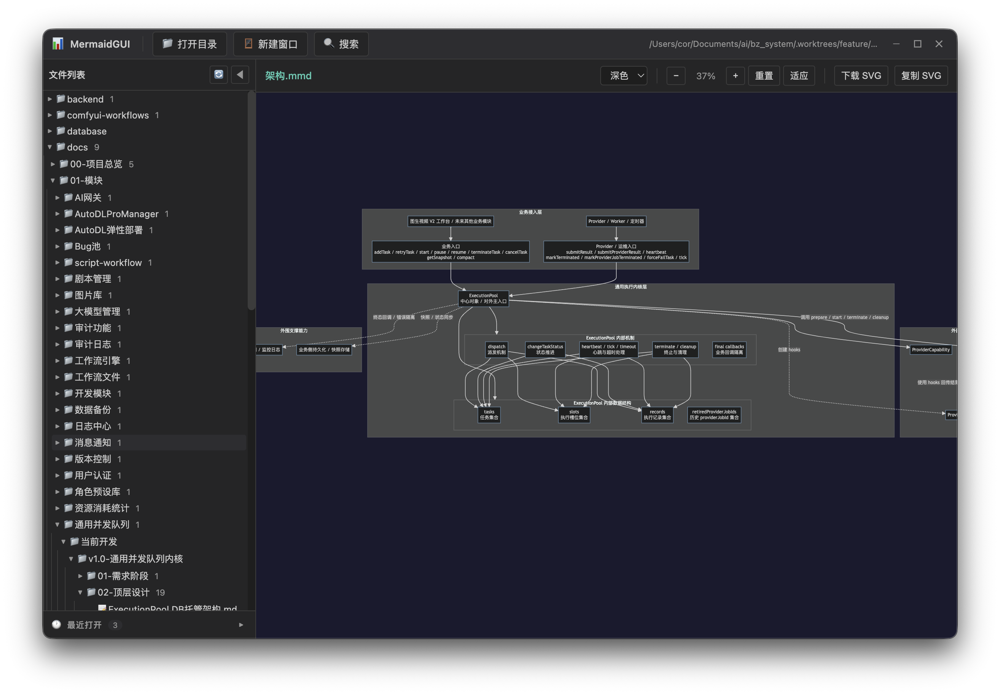

# MermaidGUI

一个基于 Electron + Vue 3 的桌面应用，用于查看和渲染 Mermaid 图表与 Markdown 文件。



## 功能特性

- **Mermaid 图表渲染**：支持 `.mmd` 和 `.mermaid` 文件的实时渲染
- **Markdown 支持**：完整渲染 Markdown 文件，包括内嵌的 Mermaid 代码块
- **树形文件浏览**：直观的目录结构展示，支持文件操作
- **多窗口支持**：可在新窗口中打开不同文件
- **搜索功能**：快速搜索文件内容，支持高亮显示
- **悬浮预览**：独立窗口预览文件内容
- **跨平台**：支持 Windows、macOS 和 Linux

## 技术栈

- **Electron** - 跨平台桌面应用框架
- **Vue 3** - 前端框架
- **TypeScript** - 类型安全的 JavaScript
- **Mermaid** - 流程图渲染库
- **Marked** - Markdown 解析器
- **Highlight.js** - 代码语法高亮

## 快速开始

### 环境要求

- Node.js >= 18.x
- npm >= 9.x

### 安装与运行

```bash
# 克隆项目
git clone https://github.com/1057376155/MermaidGUI.git

# 进入项目目录
cd MermaidGUI

# 安装依赖（国内用户建议配置镜像源）
npm install

# 开发模式运行
npm run dev

# 构建应用
npm run build

# 打包应用
npm run dist
```

### 国内镜像配置

由于 Electron 二进制文件托管在 GitHub，国内下载可能较慢，建议配置镜像：

```bash
# 临时设置环境变量（推荐）
export ELECTRON_MIRROR="https://npmmirror.com/mirrors/electron/"

# 或配置 npm 镜像源
npm config set registry https://registry.npmmirror.com
npm config set electron_mirror https://npmmirror.com/mirrors/electron/
```

## 使用说明

1. **打开目录**：点击工具栏的"打开目录"按钮，选择包含 `.mmd`、`.mermaid` 或 `.md` 文件的目录
2. **浏览文件**：左侧文件树显示目录结构，点击文件可查看内容
3. **渲染图表**：选择 `.mmd` 文件会直接渲染 Mermaid 图表
4. **查看 Markdown**：选择 `.md` 文件会渲染 Markdown 内容，包括内嵌的 Mermaid 图表
5. **搜索内容**：使用 `Ctrl+F`（Windows/Linux）或 `Cmd+F`（macOS）打开搜索面板
6. **多窗口**：右键文件选择"在新窗口打开"，或使用工具栏的"新建窗口"按钮

## 项目结构

```
MermaidGUI/
├── build/              # 构建资源（图标等）
├── docs/               # 项目文档
├── src/                # 源代码
│   ├── main/          # Electron 主进程
│   ├── preload/       # 预加载脚本
│   └── renderer/      # Vue 前端
├── electron.vite.config.ts
├── package.json
└── tsconfig.json
```

## 打包指南

详细的打包说明请参考 [打包指南](docs/BUILD_GUIDE.md)。

### 快速打包

```bash
# Windows
npm run build && npm run dist:win

# macOS
npm run build && npm run dist:mac

# Linux
npm run build && npm run dist:linux
```

## 开发

### 开发模式

```bash
npm run dev
```

### 代码检查

项目使用 TypeScript 进行类型检查，建议在开发时使用支持 TypeScript 的 IDE。

## 贡献

欢迎提交 Issue 和 Pull Request。

## 许可证

本项目采用 MIT 许可证。

## 相关链接

- [Electron 官方文档](https://www.electronjs.org/docs)
- [Vue 3 文档](https://vuejs.org/)
- [Mermaid 文档](https://mermaid.js.org/)
- [electron-builder 文档](https://www.electron.build/)
- [electron-vite 文档](https://electron-vite.org/)